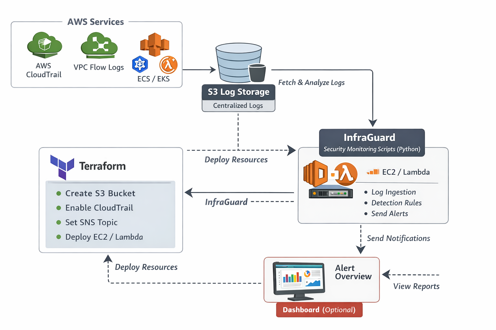

# 🛡️ InfraGuard

**Shift-Left AWS Security Monitoring with Automated CI/CD Pipeline**

[](https://www.python.org/downloads/)
[](https://www.terraform.io/)
[](https://aws.amazon.com/)
[](LICENSE)

InfraGuard is a comprehensive AWS security monitoring solution that combines **runtime infrastructure scanning** with **shift-left security** to detect and prevent security misconfigurations before deployment.



## 🌟 Key Features

- **🔍 Dual-Mode Security Scanning**
  - **Runtime Scanning**: Monitor existing AWS infrastructure for security risks
  - **Plan-Time Scanning**: Analyze Terraform plans before deployment (shift-left)
  
- **🚀 Automated CI/CD Pipeline**
  - GitHub Actions integration with security gates
  - Blocks deployments with critical security findings
  - Automatic infrastructure deployment on push to main

- **☁️ Full Terraform Infrastructure**
  - CloudTrail for audit logging
  - VPC Flow Logs for network monitoring
  - S3 buckets with encryption and versioning
  - Lambda-based automated scanning
  - IAM roles following least privilege

- **🎯 Comprehensive Security Checks**
  - **S3**: Public access, encryption, versioning
  - **Security Groups**: SSH/RDP exposure, overly permissive rules
  - **IAM**: Overpermissive policies, unused credentials
  - **CloudTrail**: Audit logging configuration
  - **VPC**: Flow logs enablement

## 📚 Documentation

- **[Quick Start Guide](docs/QUICKSTART.md)** - Get started in 5 minutes
- **[Architecture Overview](docs/ARCHITECTURE.md)** - System design and components
- **[Deployment Guide](docs/DEPLOYMENT.md)** - CI/CD pipeline setup
- **[Shift-Left Security](docs/SHIFT_LEFT.md)** - Plan-time scanning implementation
- **[AWS Setup](docs/AWS_SETUP.md)** - AWS prerequisites and configuration
- **[API Reference](docs/API.md)** - CLI commands and usage

## 🚀 Quick Start

### Prerequisites

- Python 3.11+
- AWS Account
- Terraform 1.6+
- GitHub Account (for CI/CD)

### 1. Clone and Install

```bash
git clone https://github.com/yourusername/InfraGuard.git
cd InfraGuard
pip install -r requirements.txt
```

### 2. Configure AWS

```bash
aws configure
export AWS_REGION=eu-north-1
```

### 3. Run Local Security Scan

```bash
# Scan existing infrastructure
python main.py check-all

# Scan Terraform plan before deployment
terraform plan -out=tfplan
terraform show -json tfplan > tfplan.json
python main.py scan-plan --plan-file tfplan.json
```

### 4. Deploy Infrastructure

```bash
# Bootstrap Terraform backend
cd terraform/bootstrap
terraform init
terraform apply

# Deploy main infrastructure
cd ..
terraform init
terraform apply
```

See [Quick Start Guide](docs/QUICKSTART.md) for detailed instructions.

## 🏛️ Architecture

```
┌──────────────────────────────────────┐
│       GitHub Actions Pipeline          │
│  (Push to main triggers deployment)   │
└────────────┬─────────────────────────┘
             │
     ┌───────┼─────────┐
     │                    │
┌────┴────┐          ┌────┴────┐
│ Runtime  │          │ Plan-Time │
│ Scanning │          │ Scanning  │
│ (Existing)│          │ (Shift-  │
│   Infra)  │          │   Left)   │
└────┬────┘          └────┬────┘
     │                    │
     └───────┬───────────┘
            │
    ┌───────┴───────┐
    │ Security Gate  │
    │ (Block on     │
    │  Critical)    │
    └───────┬───────┘
            │
    ┌───────┴───────┐
    │   Terraform   │
    │     Apply     │
    └───────┬───────┘
            │
    ┌───────┴────────────────┐
    │  AWS Infrastructure    │
    │ • CloudTrail          │
    │ • VPC Flow Logs      │
    │ • Lambda Scanner     │
    │ • S3 Buckets         │
    └──────────────────────┘
```

See [Architecture Documentation](docs/ARCHITECTURE.md) for details.

## 📊 Usage Examples

### Runtime Scanning

```bash
# Scan all AWS resources
python main.py check-all --output-file findings.json

# Scan specific services
python main.py check-iam
python main.py check-s3
python main.py check-network
```

### Plan-Time Scanning (Shift-Left)

```bash
# Create and scan Terraform plan
cd terraform
terraform plan -out=tfplan
terraform show -json tfplan > tfplan.json
python ../main.py scan-plan --plan-file tfplan.json
```

### CI/CD Pipeline

The pipeline automatically runs on every push to `main`:

1. **Security Scan** - Scans existing AWS infrastructure
2. **Security Gate** - Blocks on critical findings
3. **Terraform Plan** - Creates deployment plan
4. **Plan Scan** - Analyzes planned changes (shift-left)
5. **Deploy** - Applies infrastructure if all checks pass

## 🛠️ Development

### Project Structure

```
InfraGuard/
├── infra_guard/          # Core Python package
│   ├── policy_engine.py  # Reusable security policies
│   ├── plan_analyzer.py  # Terraform plan scanner
│   ├── detection_rules.py # Runtime scanner
│   └── ...
├── terraform/            # Infrastructure as Code
│   ├── modules/          # Reusable Terraform modules
│   ├── bootstrap/        # Backend initialization
│   └── main.tf           # Main configuration
├── .github/workflows/    # CI/CD pipeline
│   └── security-scan.yml
├── docs/                 # Documentation
├── tests/                # Test suites
└── main.py               # CLI entry point
```

### Running Tests

```bash
# Run test pipeline locally
bash test_pipeline.sh

# Test with insecure configuration
cd test_plan/insecure_test
terraform plan -out=tfplan
terraform show -json tfplan > tfplan.json
python ../../main.py scan-plan --plan-file tfplan.json
```

## 📝 Severity Levels

- **🔴 CRITICAL**: Immediate security risk (e.g., S3 bucket public, default security group open)
- **🟠 HIGH**: Significant security concern (e.g., SSH open to internet, no CloudTrail)
- **🟡 MEDIUM**: Moderate security issue (e.g., no VPC Flow Logs)
- **🟢 LOW**: Best practice recommendation (e.g., S3 versioning disabled)

## 🤝 Contributing

Contributions are welcome! Please:

1. Fork the repository
2. Create a feature branch (`git checkout -b feature/amazing-feature`)
3. Commit your changes (`git commit -m 'Add amazing feature'`)
4. Push to the branch (`git push origin feature/amazing-feature`)
5. Open a Pull Request

## 📜 License

This project is licensed under the MIT License - see the LICENSE file for details.

## ❤️ Acknowledgments

- Inspired by AWS security best practices
- Built with Terraform, Python, and GitHub Actions
- Shift-left security methodology

## 📞 Support

For questions or issues:
- Open an issue on GitHub
- Check the [documentation](docs/)
- Review [examples](test_plan/)

---

**Built with ❤️ for AWS Security**
